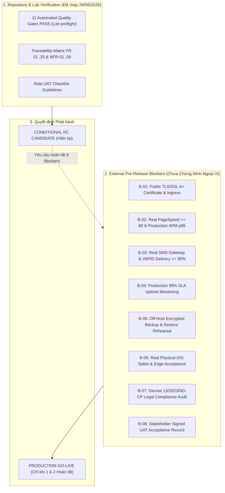

# Biên bản Sẵn sàng Phát hành Bản ứng viên (Release Candidate Readiness Record)

Tài liệu này tổng hợp tình trạng sẵn sàng kỹ thuật, ma trận cổng kiểm soát chất lượng tự động (**Automated Quality Gates**), danh mục điểm nghẽn ngoại vi bắt buộc (**External Go-Live Blockers**), và kết luận phân định ranh giới phát hành cho phiên bản ứng viên (**Release Candidate — RC**) của nền tảng **QuanLyKhuPho**.

---

## 1. Thông tin Chung & Baseline Mã Nguồn (Release Metadata & Baseline)

| Thuộc tính (Property) | Giá trị ghi nhận (Value) |
| :--- | :--- |
| **Tên sản phẩm** | Nền tảng Quản lý Khu phố Điện tử — QuanLyKhuPho |
| **Phiên bản Ứng viên (RC Tag)** | Dự kiến `v1.0.0-rc.1` — chưa tạo Git tag |
| **Mã băm Commit Baseline** | `b633c4c` |
| **Phạm vi thay đổi so với Baseline** | Bổ sung ba tài liệu chất lượng; sửa runner smoke chỉ build hai image duy nhất (`api`, `web`) để tránh tranh chấp tag giữa `api`, `migrate`, `sms-worker`; bổ sung test hồi quy. Loại trừ thay đổi tiền tồn tại của `apps/web/next-env.d.ts`. |
| **Trạng thái Phát hành Tổng quát** | **`CONDITIONAL RC CANDIDATE — NOT PRODUCTION GO-LIVE`** |
| **Ngày xác minh tự động** | 29/08/2026 (Asia/Bangkok) |
| **Bên chịu trách nhiệm xác minh** | Codex; bản nháp tài liệu do Antigravity Gemini 3.7 Flash High hỗ trợ và đã được review độc lập |

---

## 2. ⚠️ Tuyên bố Ranh giới Bằng chứng Kỹ thuật (Evidence Boundary Notice)

> [!WARNING]
> **Quy định Phân định Ranh giới & Trung thực Kỹ thuật**
> 1. **11 cổng tự động đã được Codex chạy và đạt ngày 29/08/2026** trên máy phát triển với database/Redis cô lập và stack smoke tạm thời. Đây là snapshot gắn với working tree sau baseline `b633c4c`, chưa phải một Git tag hay artifact đã ký.
> 2. **Không ngộ nhận Năng lực Sản xuất Ngoại vi**: Toàn bộ kết quả dưới đây chỉ cấu thành **Bằng chứng Phòng thí nghiệm / Tiền kiểm tra Xác định (Deterministic Lab/CI Preflight Evidence)**.
> 3. **Ranh giới Go-Live bắt buộc**: Tuyệt đối không đưa hệ thống vào vận hành sản xuất thực tế khi chưa hoàn tất 8 nhóm bằng chứng ngoại vi tại Mục 4 (chứng chỉ TLS A+, PageSpeed trên URL Internet, tỷ lệ SMS/Web Push thực tế, Uptime SLA 99%, sao lưu ngoài máy chủ off-host, thiết bị vật lý iOS Safari/Edge, tuân thủ Nghị định 13/2023/NĐ-CP, và chữ ký UAT của các bên liên quan).

---

## 3. Ma trận 11 Cổng Kiểm soát Chất lượng Tự động (Automated Quality Gates Matrix)

Các kết quả dưới đây được Codex ghi nhận trực tiếp ngày 29/08/2026 trên working tree hiện tại; cần được CI lặp lại sau khi tạo commit/tag RC bất biến:

| Cổng (Gate) | Lệnh Thực thi (Exact Command) | Phạm vi & Tiêu chí Kiểm chứng | Trạng thái Hiện tại | Kết quả Đo lường & Ghi nhận Thực tế (Codex Verification) |
| :---: | :--- | :--- | :---: | :--- |
| **G-01** | `pnpm e2e` | **Multi-Browser Public Shell**<br>• Chromium, Firefox, WebKit × desktop 1920x1080 và mobile 320x568.<br>• Nội dung tiếng Việt, responsive/không tràn ngang, modal đăng nhập và Web Shell $\le 3000\text{ ms}$. Hành trình ba vai trò full-stack là bằng chứng riêng của phase trước, không thuộc lệnh này. | **`PASS (LAB)`** | • 18/18 passed trong 34,5 giây.<br>• Shell chậm nhất quan sát: 2,6 giây.<br>• Có cảnh báo Next standalone khi web server test dùng `next start`; không làm sai kết quả. |
| **G-02** | `pnpm security:api` | **Security Authorization & IDOR Acceptance Gate**<br>• API production build, PostgreSQL schema `qlkp_e2e`, Redis DB 15.<br>• RBAC ba vai trò, cô lập KP-01/KP-02, chống IDOR, thu hồi phiên khi khóa và che dữ liệu xuất. | **`PASS (LAB)`** | • 10/10 passed trong 6,4 giây.<br>• 0 lỗi phân quyền; raw fixture phone/CCCD không xuất hiện trong CSV.<br>• Khóa fallback chỉ dành cho lab; production vẫn phải cấp secret thật. |
| **G-03** | `pnpm perf:api` | **API Latency Benchmark Gate (SRS NFR-03)**<br>• 5 endpoint đại diện; 30 mẫu/endpoint, tổng 150 request, concurrency 5.<br>• Tiêu chí: 0 lỗi và $p95 < 500\text{ ms}$ theo Nearest-Rank. | **`PASS (LAB)`** | • 6/6 tests, 0/150 request lỗi.<br>• Aggregate p50 13,05 ms; p95 37,41 ms; p99 42,86 ms; max 57,74 ms.<br>• Endpoint p95 cao nhất 42,86 ms. |
| **G-04** | `pnpm production:acceptance -- --tag=rc-20260829-r2` | **Production Container Smoke Gate**<br>• Build image hiện tại và chạy 7 container trong project/volume/network `smoke` cô lập.<br>• Migration, health, worker, bốn hợp đồng HTTP/HTTPS và cleanup. | **`PASS (LAB)`** | • Build image thành công; migration exit 0; SMS worker 0 restart; các service healthy.<br>• 4/4 runtime contracts passed.<br>• Stack, network và volume smoke đã dọn sạch. |
| **G-05** | `pnpm lint` | **Static Code Analysis & Linting Gate** | **`PASS (LAB)`** | • Exit 0; 5/5 Turbo tasks thành công; không có lỗi ESLint. |
| **G-06** | `pnpm typecheck` | **Strict TypeScript Compilation Gate** | **`PASS (LAB)`** | • Exit 0; 5/5 Turbo tasks thành công; 0 lỗi TypeScript. |
| **G-07** | `pnpm --filter @quanlykhupho/api exec prisma validate` | **Database Schema Integrity Gate** | **`PASS (LAB)`** | • Exit 0; `prisma/schema.prisma` hợp lệ. |
| **G-08** | `pnpm test` | **Monorepo Unit & Integration Tests Gate** | **`PASS (LAB)`** | • 57 test files, 736 tests passed: shared-types 38, web 129, API 569.<br>• 4/4 Turbo tasks; 0 failure. |
| **G-09** | `pnpm test:ops` | **Operational Runbooks Test Suite Gate** | **`PASS (LAB)`** | • 28 suites, 99/99 tests passed sau sửa build runner; 0 failure. |
| **G-10** | `pnpm build` | **Production Build Gate** | **`PASS (LAB)`** | • Exit 0; 3/3 Turbo build tasks thành công; API và Next.js Web build thành công. |
| **G-11** | `git diff --check` | **Whitespace & Conflict Artifacts Gate** | **`PASS (LAB)`** | • Exit 0; diff sạch whitespace/conflict artifacts. |

---

## 4. Danh mục Rào chắn Ngoại vi & Điểm nghẽn Go-Live (External Go-Live Blockers)

Dưới đây là 8 rào chắn ngoại vi bắt buộc cần hoàn thành trên hạ tầng môi trường thật trước khi đưa hệ thống vào vận hành sản xuất chính thức:



### Chi tiết 8 Điểm nghẽn Ngoại vi Cần Giải phóng:

1. **`BLOCKER-01`: Chứng chỉ SSL/TLS Công khai & Cấu hình Reverse Proxy (NFR-01)**
   - *Yêu cầu*: Thiết lập Reverse Proxy công khai (Nginx / Caddy / Cloudflare Ingress) với chứng chỉ TLS/SSL hợp lệ từ CA uy tín, đạt điểm SSL Labs loại A+, kích hoạt HSTS và WAF.
   - *Trạng thái*: **`PENDING EXTERNAL SETUP`**

2. **`BLOCKER-02`: Đo lường Google PageSpeed Insights & Độ trễ APM Production (NFR-03)**
   - *Yêu cầu*: Chạy kiểm tra Google PageSpeed Insights trên URL Staging/Production đạt điểm $\ge 80$ trên cả Mobile và Desktop; thiết lập APM (OpenTelemetry/Prometheus) giám sát độ trễ API $p95 < 500\text{ ms}$ dưới tải cao điểm thực tế của phường.
   - *Trạng thái*: **`PENDING PRODUCTION MEASUREMENT`**

3. **`BLOCKER-03`: Tích hợp Cổng SMS Viễn thông & Đo lường Tỷ lệ Web Push (NFR-04)**
   - *Yêu cầu*: Ký hợp đồng và nạp thông tin xác thực cổng SMS Brandname chính thức; cấu hình cặp khóa VAPID sản xuất và đo lường tỷ lệ phân phát Web Push thực tế tới thiết bị người dùng $\ge 90\%$.
   - *Trạng thái*: **`PENDING PROVIDER INTEGRATION`**

4. **`BLOCKER-04`: Giám sát Độ sẵn sàng Hệ thống 99% Uptime (NFR-08)**
   - *Yêu cầu*: Thiết lập hệ thống giám sát ngoại vi độc lập (Synthetic Uptime Monitor) kiểm tra `/api/health/ready` định kỳ, thiết lập cảnh báo sự cố 24/7 và cam kết SLA độ sẵn sàng $\ge 99\%$.
   - *Trạng thái*: **`PENDING INFRASTRUCTURE SETUP`**

5. **`BLOCKER-05`: Lưu trữ Bản sao lưu Ngoài Máy chủ (Off-Host Storage) & Diễn tập Phục hồi (NFR-08)**
   - *Yêu cầu*: Thiết lập cron scheduler hạ tầng thực thi `pnpm db:backup`, mã hóa bản sao lưu bằng KMS chuyên dụng, tự động đồng bộ sang kho lưu trữ ngoài máy chủ (S3 / GCS), và tổ chức diễn tập phục hồi thực tế trên CSDL sandbox cô lập theo [Sổ tay Sao lưu & Phục hồi CSDL](../operations/database-backup-restore.md).
   - *Trạng thái*: **`PENDING CLOUD STORAGE & DRILL`**

6. **`BLOCKER-06`: Nghiệm thu trên Thiết bị Vật lý Apple iOS Safari & Microsoft Edge (NFR-05, NFR-06)**
   - *Yêu cầu*: Thực hiện kiểm thử trực tiếp trên điện thoại iPhone thật chạy iOS 16.4+ Safari gốc (kiểm tra bàn phím ảo, safe area, thanh URL co giãn, cử chỉ cuộn) và máy tính Microsoft Edge bản thương mại theo kịch bản `UAT-DEV-01` và `UAT-DEV-02`.
   - *Trạng thái*: **`PENDING PHYSICAL DEVICE TESTING`**

7. **`BLOCKER-07`: Đánh giá Tuân thủ Quy chuẩn An toàn Thông tin & Nghị định 13/2023/NĐ-CP (NFR-07)**
   - *Yêu cầu*: Hoàn thành rà soát và đánh giá tác động bảo vệ dữ liệu cá nhân theo Nghị định số 13/2023/NĐ-CP của Chính phủ đối với dữ liệu nhân khẩu lưu trữ trong hệ thống; kiểm toán quản trị khóa mã hóa KMS.
   - *Trạng thái*: **`PENDING LEGAL & COMPLIANCE REVIEW`**

8. **`BLOCKER-08`: Biên bản Nghiệm thu UAT Người dùng Thực tế có Đủ Chữ ký (NFR-09)**
   - *Yêu cầu*: Tổ chức phiên nghiệm thu chấp nhận người dùng thực tế với đại diện Cư dân, Tổ trưởng dân phố và Cán bộ phường theo tài liệu [Danh mục Kiểm thử Nghiệm thu Người dùng](uat-checklist.md) và ký biên bản xác nhận hoàn thành.
   - *Trạng thái*: **`PENDING STAKEHOLDER SIGN-OFF`**

---

## 5. Kết luận Sẵn sàng Phát hành (Release Readiness Verdict)

Dựa trên việc rà soát toàn diện hiện trạng mã nguồn, cấu hình hệ thống và ranh giới bằng chứng kỹ thuật:

> [!IMPORTANT]
> ### KẾT LUẬN CUỐI CÙNG:
> **`CONDITIONAL RC CANDIDATE — NOT PRODUCTION GO-LIVE`**
>
> **Giải thích**:
> 1. Ma trận truy xuất đã bao quát **FR-01 → FR-25** và **NFR-01 → NFR-09**; 11 cổng tự động hiện đạt trong lab. Điều này đủ để chuyển bản build sang **nghiệm thu UAT/RC có điều kiện**, không chứng minh rằng toàn bộ NFR production đã hoàn tất.
> 2. Hệ thống **CHƯA ĐỦ ĐIỀU KIỆN ĐỂ GO-LIVE SẢN XUẤT** cho đến khi:
>    - **Bước 1**: Tạo commit/tag RC bất biến và để CI lặp lại 11 gate trên đúng commit đó.
>    - **Bước 2**: Đơn vị vận hành và các bên liên quan hoàn tất nghiệm thu và giải phóng 8 rào chắn ngoại vi (**BLOCKER-01 → BLOCKER-08**) tại Mục 4.

---

## 6. Hướng dẫn Tiếp theo cho Codex (Codex Action Items)

1. **Lặp lại các lệnh dưới đây trong CI trên commit/tag RC bất biến**:
   ```bash
   # 1. Multi-browser public shell
   pnpm e2e

   # 2. Security authorization & IDOR
   pnpm security:api

   # 3. API latency performance benchmark
   pnpm perf:api

   # 4. Production container smoke gate
   pnpm production:acceptance -- --tag=rc-20260829-r2

   # 5. Monorepo quality & consistency checks
   pnpm lint
   pnpm typecheck
   pnpm --filter @quanlykhupho/api exec prisma validate
   pnpm test
   pnpm test:ops
   pnpm build
   git diff --check
   ```
2. **Bàn giao UAT**: Chuyển `docs/quality/uat-checklist.md` cho QA và đại diện người dùng; ghi PASS/FAIL/BLOCKED và defect evidence bằng dữ liệu giả lập.
3. **Chỉ go-live** sau khi cả CI trên tag RC và 8 blocker external đều hoàn tất.
